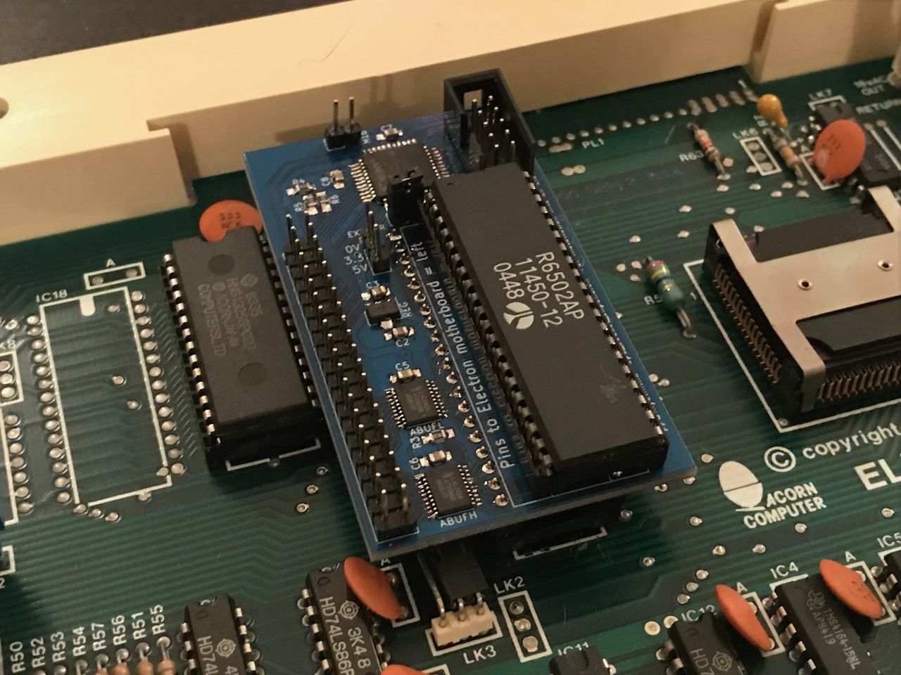

In-development board that intercepts signals from the Acorn Electron
or BBC Micro's 6502 CPU, and provides a very flexible interface into
the heart of the machine.  (Good enough to implement something like
the Slogger MRB, or to use a soft CPU in an FPGA, or to do a 3.3V
flash/RAM/IO board.)

I've assembled one of these and tried it out with no daughterboard
connected, in an Electron, with very basic HDL that just copies
A15:A13 from the CPU to the motherboard.  It boots fine, as expected.
The next step is to try the miniSpartan + Pi Zero daughterboard, and
implement some sideways ROM and RAM.

[pcb/](pcb/) - PCB design

[cpld/](cpld/) - CPLD design, which assumes you have a 6502 in the top
socket (i.e. the address buffers are always pointed *away* from the
CPU).

