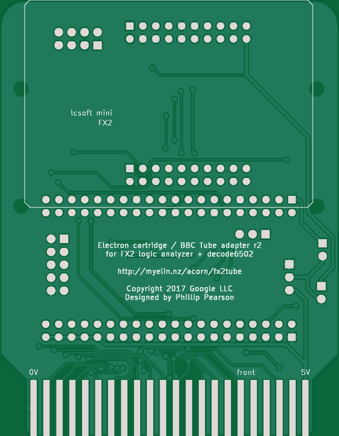

FX2 Tube/Cartridge Adapter
==========================

http://myelin.nz/acorn/fx2tube

An adapter board to make it easy to monitor your Electron, BBC Micro, or BBC
Master's bus using a cheap logic analyzer.  It also functions as an adapter
for PiTubeDirect.

[Support thread on the Stardot forums](http://www.stardot.org.uk/forums/viewtopic.php?f=3&t=14319)

On the Electron, it plugs into a cartridge slot on the Plus 1.  It can
monitor the bus when an FX2 board is connected, and when a Raspberry
Pi running PiTubeDirect is attached, it will perform voltage
conversion, clean up the clock, and generate the /TUBE signal
required.  You'll still need to have a Tube client ROM installed; most
filing systems (including MMFS) provide this.

On the BBC Micro, it attaches to the Tube port via a 40-pin cable.
The easiest way to find one of these nowadays is to search eBay for a
Raspberry Pi GPIO cable.  As on the Electron, it will allow bus
monitoring and perform signal conversion for PiTubeDirect.

On the BBC Master, it's a bit more complicated.  To monitor the bus,
it must be plugged into a cartridge slow (as on the Electron), but to
provide signal conversion for PiTubeDirect, it must be connected to
the Tube port (as on the BBC Micro).  With a modified Tube client ROM,
it will be possible to perform both operations at once when plugged
into a cartridge slot.

Tested combinations:
- Acorn Electron via Minus One, with FX2
- Acorn Electron via Minus One, with FX2 and Raspberry Pi Zero
- BBC Master via Tube port, with Raspberry Pi Zero (requires different VHDL)

Not yet tested:
- BBC Model B via Tube port, with FX2 and/or Raspberry Pi Zero
- BBC Master via cartridge slot, with FX2

### Bill of materials

- R1, R2, R3, R4, R6 - 1k 0805 resistor
- R5 - 10k 0805 resistor
- D1 - BAT54 SOD323 diode
- C1, C2 - 100nF 0805 capacitor
- C3, C4, C5 - 1uF 0805 capacitor
- PL1 - [XC9572XL-xxVQG44 CPLD](https://www.digikey.com/product-detail/en/xilinx-inc/XC9572XL-10VQG44I/122-1981-ND/1957201)
- U1 - [MCP1700T-3302E/MB voltage regulator](https://www.digikey.com/product-detail/en/microchip-technology/MCP1700T-3302E-MB/MCP1700T3302EMBCT-ND/652679)
- Female 0.1" headers for FX2 and Raspberry Pi Zero
- JTAG1 - [Male 2x5 0.1" header](https://www.digikey.com/products/en?keywords=ED1543-ND)
- Male 0.1" headers for PIPWR, EXTPWR, SERIAL1, TUBE, and the jumper
  block
- Several 0.1" jumpers

### Renders of the PCB

Planning
--------

This was originally just going to be a quick adapter board to allow attaching an
lctech Cypress EZ-USB FX2 board to an Electron cartridge port or a BBC Tube
port.  The clock instability on the Electron forced the addition of the CPLD, at
which point it would have been a waste not to also put in level shifting for
PiTubeDirect.

All the signals to the logic analyzer except nNMI, nIRQ, READY, and SYNC are
provided to the Pi.  The Tube socket includes nIRQ, but nNMI and READY have to
come out from the cartridge port, and SYNC is a flying lead on all machines.

It's probably easiest to move the Tube socket over by the cartridge pins, then
have the CPLD above it, then the Pi, and finally the logic analyzer.

Pins that have to go from the cartridge port to the CPLD but aren't on the Tube
port: A7, /INFC, 16MHz.  Pins that have to go to the logic analyzer but not CPLD
or Tube: /NMI, READY.

We need 35 CPLD pins to do this properly.  elk_pi_tube_direct only needs 34, but
we need the 16 MHz clock here.  Hoglet suggests using a Schottky diode and
pullup to convert nRESET, which I think is the easiest solution.  Another option
would be to use a 64-pin CPLD, but those are harder to solder (although would
allow a few more signals, if we think of anything there).
