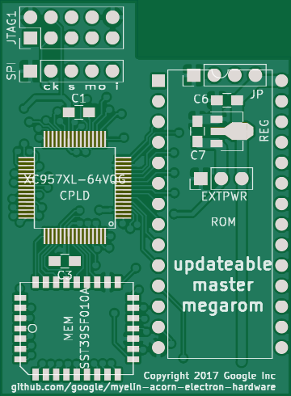

Upgradeable BBC Master MegaROM
==============================

http://myelin.nz/acorn/megarom

A board that replaces IC24, the 1 megabit ROM containing the OS and sideways
banks 9-15 on a Master 128, and allows you to update the contents of the ROM
over USB (via a microcontroller) while the machine is running.

Status: I've built up a PCB with an SST39SF010A (128kB) flash chip,
implemented the CPLD design, and written the AVR firmware.  Flash programming
and readback works, although can be flaky at times (I think my CPLD design is
buggy or I messed up by not putting SCK on a global clock pin).  When tested
in a Master 128, the host machine can read the flash OK, but the CPLD
interface just fails completely.  I'm debugging this.

- [PCB design](pcb/)
- [Xilinx XC9572-64VQG CPLD design](cpld/)
- [Pro Micro firmware for USB interface](avr_firmware/)

Installation
------------

First test the board outside the Master 128.  Connect a JTAG adapter to the JTAG
port on the top left of the board, which uses the Altera USB Blaster pinout,
with pin 1 on the bottom left.

Wire the SPI port up to an ATMEGA32U4-based Arduino board, like a Leonardo or
Pro Micro.  From left to right: GND, SCK (Arduino pin 15), SS (pin 10), MOSI
(pin 16), MISO (pin 14).

Connect power to the EXTPWR port -- GND on the left, 5V on the right.

Program the CPLD and the ATMEGA32U4, then make a serial connection to the board
and send I<CR>.  It should respond with the size of the flash chip, and "OK".

To program an image into the flash: python program_rom.py <rom file>

To read the current flash image: python read_rom.py

