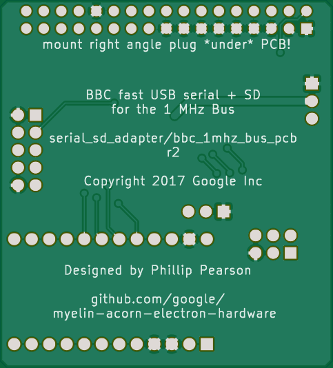

serial_sd_adapter
=================

This is something I'm working on to provide a fast serial port with
reliable flow control for a BBC or Electron.  On the BBC, it attaches
to the 1MHz bus, and on the Electron, it'll be a cartridge.

In either case it consists of:

- a CPLD to communicate with the host machine's bus and share the SD
  card between the host machine and the Pro Micro.

- a Pro Micro to provide a USB serial port, and act as a
  [HostFS](http://mdfs.net/Software/Tube/Serial/) server.

At present, it works well with a hacked-up version of J.G.Harston's
HostFS, running against sweh's TubeHost code on an attached laptop.
This provides quite a quick filing system that leaves PAGE=&E00, as
all the buffers are in the host machine's memory.

I'm still figuring out if I can distribute HostFS or TubeHost as part
of this repository, but for the moment here's what you need to do:

- Download [TubeHost from sweh's site](https://www.spuddy.org/Beeb/TubeHost/).

- Download the [HostFS source from J.G.Harston's site](TODO).

Electron version
----------------

This is the first one I tried, using a modified
[elk_pi_tube_direct](../elk_pi_tube_direct/) cartridge.  I haven't made a proper
PCB for it yet.

The CPLD design is in [cpld/](cpld/), and the MCU firmware is in
[serial_sd_mcu/](serial_sd_mcu/).

[Discussion on the Stardot forums](http://stardot.org.uk/forums/viewtopic.php?f=3&t=13292).

BBC version
-----------

The PCB is in [bbc_1mhz_bus_pcb/](bbc_1mhz_bus_pcb/) and the CPLD design is in
[bbc_1mhz_bus_cpld/](bbc_1mhz_bus_cpld/).  It uses the same MCU firmware as the
Electron version, from [serial_sd_mcu/](serial_sd_mcu/).

[Discussion on the Stardot forums](http://stardot.org.uk/forums/viewtopic.php?f=3&t=14033).

